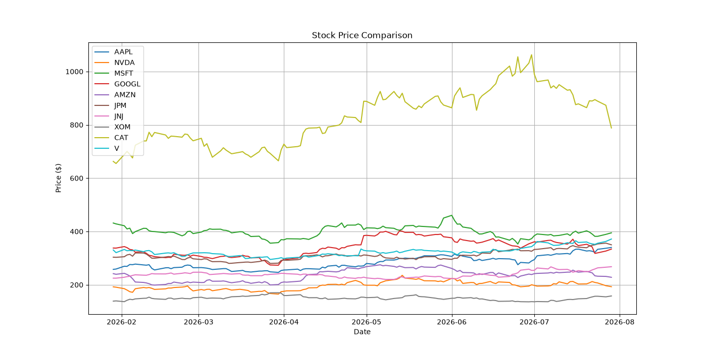
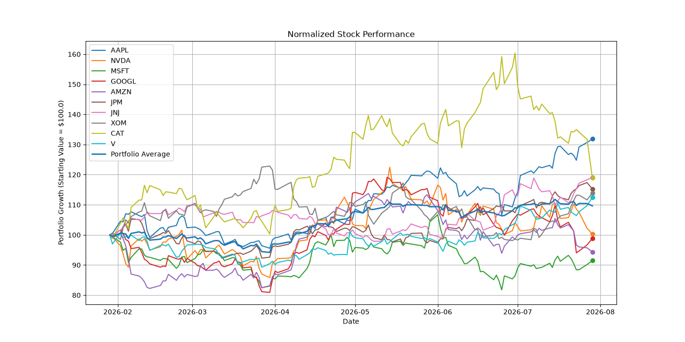
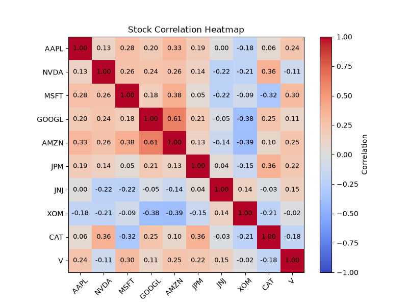
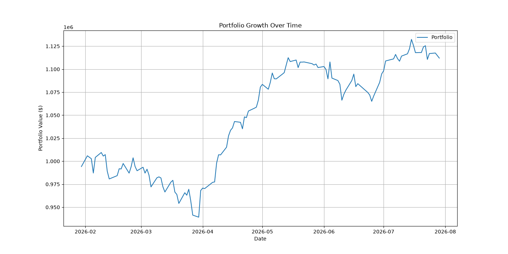
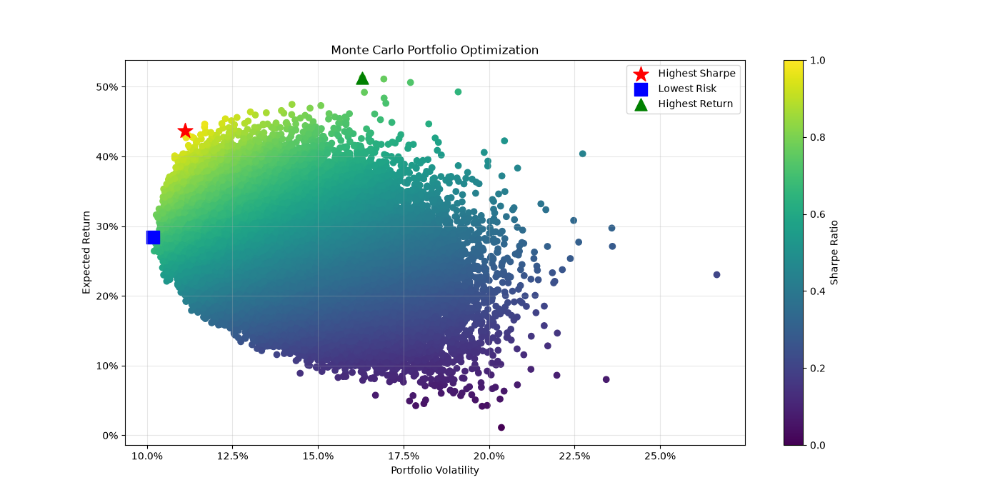
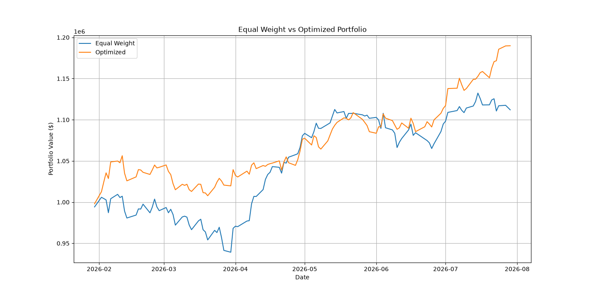

Portfolio Optimizer

Overview: A python based portfolio optimization tool which uses Modern Portfolio Theory and Monte Carlo Simulations to analyze stocks, compare portfolio strategies, and determine the optimal portfolio allocations. 

The program downlaods historical market data using Yahoo Finance, calculates potfolio performance metrics, analyzes risk, meausres stock correlations, and generates optimized portfolios based on:
- Highest Sharpe Ratio
- Lowest Volatility
- Highest Expected Return

Features
  Stock Data Analysis:
  - Downlaods historical stock prices using yfinance
  - Supports multiple stocks
  - Allows different time periods : 6 months, 1 year, 2 years, 5 years

    Calculates:
    - Historical Returns
    - Annual volatility
    - Latest stock prices
    - Best and worst performing stocks

  Portfolio Performance Analysis:
  The program compares an equal weight portfolio where every stock has the same allocation. 
  Calculates: 
  - Total Portfolio Return
  - Portfolio Volatility
  - Portfolio growth over time
  - Normalized stock performance
  Stocks are normalized to the same starting value to compare performance regardless of the share price.
  Example : A $300 stock and a $30 stock can both be compared bny starting them at the same normalized value.

  Correlation Analysis: 
  The program creates a correlation matrix showing how stocks move relative to each other. It identifies the most correlated and least correlated stock pair. This helps meausre diversification. If        stocks have a high correlation, they move similarly. If stocks have a low or negative correlation, the portfolio has more diversification. 

  Portfolio Optimization: 
  The program uses a Monte Carlo Simulation method to generate thousands of possible portfolio and allocations. For each simulation, the program randomly creates portfolio weights and calculates the      expected annual return, annual volatility, and sharpe ratio. The portfolio with the best metric is selected. 

  Modern Portfolio Theory (MPT): 
  This project is based on Modern Portfolio Theory, which focuses on maxiing return while also controlling risk. Instead of choosing stocks individually, MPT analyzes how stocks work together as a        portfolio. The main idea is that a portfolio is not about the performance of individual stocks, but also about how these stocks correlate and move together. 

Optimization Methods 
  1. Highest Sharpe Ratio Portfolio
  The Sharpe Ratio measures return compared to risk. Formula: Return/Volatility. A higher Sharpe Ratio means the portfolio makes more trun for each unit of risk. The program finds the portoflio with      the best risk and return performance. The program returns the expected return, volatility, sharpe ratio, and the weights/allocations for each stock in this portfolio simulation.
  2. Lowest Volatility Portfolio
  This portfolio has the lowest risk. It finds the combination of stocks with the smallest volatility. This is desinged for people who prioritize portfolio stability. The program returns the expected     return, volatility, sharpe ratio, and the weights/allocations for each stock in this portfolio simulation.
  3. Highest Return Portfolio
  This portfolio maximizes the expected return. It accepts more risk compared to the Highest Sharpe Ratio portoflio. The program returns the expected return, volatility, sharpe ratio, and the             weights/allocations for each stock in this portfolio simulation.

Final Portfolio Summary
  This program prints out a final total portfolio summary in the end. Below is an example of a portfolio summary
  Example Portfolio Summary: 
    Stocks: 10
    Trading Days: 124
    Simulations: 100000
    Equal Weight Return: 9.66%
    Highest Sharpe Return: 18.99%
    Lowest Risk Return: 12.70%
    Highest Return Portfolio: 21.63%
    Best Stock: AAPL
    Worst Stock: MSFT
    Highest Sharpe Ratio: 3.93
    Most Correlated Pair: GOOGL & AMZN
    Least Correlated Pair: AMZN & XOM

Visualizations Generated
This program creates multiple graphs. 

Stock Price Comparison: Shows the historical price movement of each stock


Normalized Stock Peformance: Compares stock prices at a normalized price. 


Correlation Heatmap: Shows relationship between stocks


Equal Weight Portfolio Growth: Shows how the equal weight portfolio value changes over time. 


Efficient Frontier: Displays simulated portfolios based on return, risk, and sharpe ratio. 


Optimized vs. Equal Weight Comparison: Compares the highest sharpe ratio portfolio against the equal weight portfolio. 


Files Generated 
After running the program: optimized_portfolio.csv and portfolio_summary.csv are created. 
optimized_portfolio.csv: 
portfolio_summary.csv: 


Technologies Used:
Python
- Numpy
- Pandas
- Matplotlib
- yFinance
Concepts
- Modern Portfolio Theory
- Monte Carlo Simulation
- Risk Analysis
- Correlation Analysis
- Statistical Modeling

Installation
1. Clone the repository
```bash
git clone git@github.com:aaravbansal19/portfolio_optimizer.git
cd portfolio_optimizer
2. Install libraries
python3 -m pip install -r requirements.txt
3. Run program
python3 main.py

